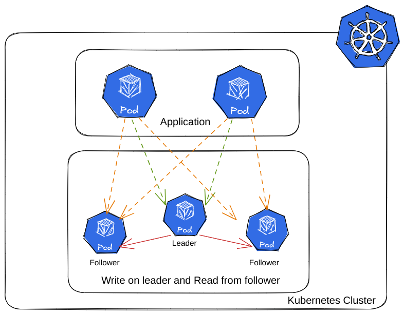
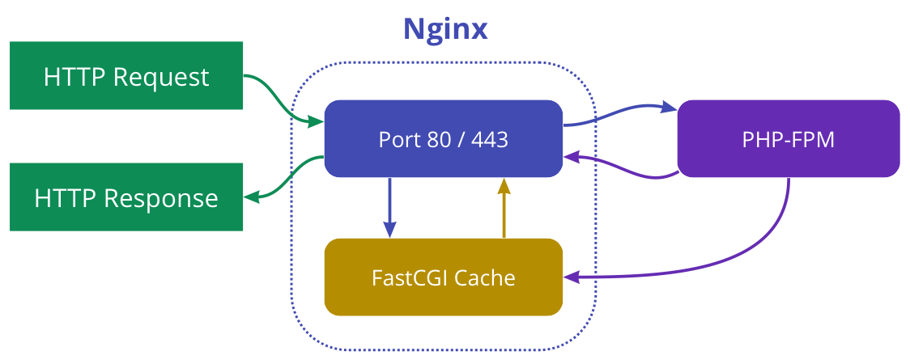

# Nextcloud-con-cluster-en-kubernetes
Instalacion de Nextcloud en kubernetes usando clusters de postgresql y redis para alta disponibilidad

## Postgresql
Postgresql es la base de datos que usaremos para almacenar la informacion de Nextcloud ademas de los metadatos que se generen. para la generacion del cluster:

### CloudNativePG
Es un operador de código abierto para Kubernetes que admite la creacion clústeres PostgreSQL basados ​​en replicación de transmisión asincrónica y sincrónica para administrar múltiples réplicas en espera activa dentro del mismo clúster de Kubernetes, con las siguientes especificaciones:

- Un servidor principal, con múltiples réplicas opcionales en espera activa para alta disponibilidad 
- Servicios disponibles para aplicaciones:
  *  **rw:** las aplicaciones se conectan solo a la instancia principal del clúster
  *  **ro:** las aplicaciones se conectan solo a réplicas en espera activa para cargas de trabajo de solo lectura (opcional)
  *  **r:** las aplicaciones se conectan a cualquiera de las instancias para cargas de trabajo de solo lectura (opcional)

El siguiente diagrama proporciona una vista simplista de la arquitectura compartida recomendada para un clúster PostgreSQL


#### Cargas de trabajo de lectura y escritura
Nextcloud usara la instancia maestra de PostgreSQL para las acciones de escritura/lectura de la base de datos, como se muestra en el siguiente diagrama:


> [!NOTE]
>Las aplicaciones usaran el servicio de sufijo **-rw**.

> [!TIP]
> En caso de indisponibilidad temporal o permanente del servidor principal, para fines de alta disponibilidad CloudNativePG activará una conmutación por error, apuntando el -rw servicio a otra instancia del clúster.

#### Cargas de trabajo de solo lectura
Nextcloud usara las instancias replicas de PostgreSQL para las acciones de lectura de la base de datos, como se muestra en el siguiente diagrama:


> [!NOTE]
> Las aplicaciones usaran el servicio de sufijo **-ro**.

### Instalacion del cluster PostgreSQL
Para la instalacion usaremos el manifiesto YAML, de la documentacion

```
kubectl apply --server-side -f \
https://raw.githubusercontent.com/cloudnative-pg/cloudnative-pg/release-1.26/releases/cnpg-1.26.0.yaml
```

Comprobamos la instalacion
```
kubectl get pods -n cnpg-system
```
```
NAME                                      READY   STATUS    RESTARTS      AGE
cnpg-controller-manager-6848689f4-l2ztv   1/1     Running   0             4m
```

Usamos el manifiesto YAML para la creacion del cluster
```yaml
apiVersion: v1
kind: Secret
metadata:
  name: postgresql-secrets
type: kubernetes.io/basic-auth
data:
  username: bmV4dGNsb3Vk
  password: cm9vdHBhc3N3b3Jk

---
apiVersion: postgresql.cnpg.io/v1
kind: Cluster
metadata:
  name: postgresql-node
spec:
  instances: 3
  imageName: ghcr.io/cloudnative-pg/postgresql:17.5
  primaryUpdateStrategy: unsupervised

  bootstrap:
    initdb:
      dataChecksums: true
      database: nextcloud
      owner: nextcloud
      secret:
        name: cluster-secrets

  resources:
    requests:
      memory: "512Mi"
      cpu: "1"
    limits:
      memory: "1Gi"
      cpu: "2"

  storage:
    size: 10Gi
    pvcTemplate:
      accessModes:
        - ReadWriteOnce
      resources:
        requests:
          storage: 1Gi
      storageClassName: standard
      volumeMode: Filesystem

  walStorage:
    size: 5Gi

  managed:
    services:
      ## disable the default services
      disabledDefaultServices: ["r"]
```
```
kubectl apply -f cluster-postgresql.yaml
```

Crearemos las copias de seguridad periódicas
```yaml
apiVersion: postgresql.cnpg.io/v1
kind: ScheduledBackup
metadata:
  name: postgresql-node-backup
  labels:
    app.kubernetes.io/component: database-backup
spec:
  schedule: "0 0 23/12 * * *"
  backupOwnerReference: none
  immediate: false
```

Verificamos el funcionamiento del cluster
```
kubectl get pods
```
```
NAME                               READY   STATUS    RESTARTS        AGE
postgresql-node-1                  1/1     Running   0               3m
postgresql-node-2                  1/1     Running   0               3m
postgresql-node-3                  1/1     Running   0               3m
```
```
kubectl get services
```
```
NAME                                 TYPE        CLUSTER-IP       EXTERNAL-IP   PORT(S)     AGE
kubernetes                           ClusterIP   10.96.0.1        <none>        443/TCP     1d
postgresql-node-ro                   ClusterIP   10.97.85.79      <none>        5432/TCP    3m
postgresql-node-rw                   ClusterIP   10.111.110.188   <none>        5432/TCP    3m
```
> [!NOTE]
> Para mayor informacion del servicio, leer la documentacion [aqui](https://cloudnative-pg.io/documentation/1.26/).

## Redis
Redis es el serviodr de almacenamiento servira como almacenamiento cache de datos de navegacion dando mayor velocidad. para la generacion del cluster:

### OT Redis Operator
Es un operador que gestiona la configuración de Redis en modo independiente, clúster, replicación y centinela sobre Kubernetes. Permite crear una configuración de clúster de Redis con las mejores prácticas.

El operador de Redis admite las siguientes estrategias de implementación para Redis:

- **Clúster:** Es simplemente una estrategia de fragmentación de datos . Particiona automáticamente los datos entre múltiples nodos de Redis. Es una función avanzada de Redis que logra almacenamiento distribuido y evita un punto único de fallo.
- **Replicación:** Utiliza replicación asíncrona, lo que significa que el nodo líder no espera a que los nodos seguidores apliquen los cambios antes de enviar nuevas actualizaciones. En su lugar, los nodos seguidores se ponen al día con el nodo líder tan pronto como pueden.
- **Sentinel:** Es una herramienta que proporciona conmutación por error y monitorización automáticas para los nodos de Redis.

Para el caso actual, usaremos el metodo de Replicacion,El siguiente diagrama proporciona una vista simplista de la arquitectura compartida



### Instalacion del Cluster Redis
Añadimos el repositorio en helm y lo instalamos
```
helm repo add ot-helm https://ot-container-kit.github.io/helm-charts/
helm install redis-operator ot-helm/redis-operator --namespace ot-operators --create-namespace 
```
Comprobamos la instalacion
```
kubectl get pods -n ot-operators
```
```
NAME                             READY   STATUS    RESTARTS      AGE
redis-operator-bb784b6df-4pfxt   1/1     Running   0             4m
```
Usamos el manifiesto YAML para la creacion del cluster
```yaml
apiVersion: redis.redis.opstreelabs.in/v1beta2
kind: RedisSentinel
metadata:
  name: redis-sentinel
spec:
  clusterSize: 3
  podSecurityContext:
    runAsUser: 1000
    fsGroup: 1000
  redisSentinelConfig:
    redisReplicationName: redis-replication
    redisReplicationPassword:
      secretKeyRef:
        name: password-nextcloud
        key: redis_password
  kubernetesConfig:
    image: quay.io/opstree/redis-sentinel:v7.0.15
    imagePullPolicy: IfNotPresent
    redisSecret:
      name: password-nextcloud
      key: redis_password
    resources:
      requests:
        cpu: "1"
        memory: "2Gi"
      limits:
        cpu: "2"
        memory: "4Gi"
---
apiVersion: redis.redis.opstreelabs.in/v1beta2
kind: RedisReplication
metadata:
  name: redis-replication
spec:
  clusterSize: 3
  kubernetesConfig:
    image: quay.io/opstree/redis:v7.0.15
    imagePullPolicy: IfNotPresent
    redisSecret:
      name: password-nextcloud
      key: redis_password
  storage:
    volumeClaimTemplate:
      spec:
        storageClassName: nfs-client
        accessModes: ["ReadWriteOnce"]
        resources:
          requests:
            storage: 10Gi
  redisExporter:
    enabled: false
    image: quay.io/opstree/redis-exporter:v1.44.0
  podSecurityContext:
    runAsUser: 1000
    fsGroup: 1000
```
```
kubectl apply -f cluster-redis.yaml
```

Verificamos el funcionamiento del cluster
```
kubectl get pods
```
```
NAME                        READY   STATUS    RESTARTS   AGE
redis-replication-0         1/1     Running   0             15m
redis-replication-1         1/1     Running   0             15m
redis-replication-2         1/1     Running   0             15m
redis-sentinel-sentinel-0   1/1     Running   0             14m
redis-sentinel-sentinel-1   1/1     Running   0             14m
redis-sentinel-sentinel-2   1/1     Running   0             14m
```
```
kubectl get services
```
```
NAME                                 TYPE           CLUSTER-IP       EXTERNAL-IP    PORT(S)        AGE
kubernetes                           ClusterIP      10.96.0.1        <none>         443/TCP        30m
redis-replication                    ClusterIP      10.111.8.17      <none>         6379/TCP       16m
redis-replication-additional         ClusterIP      10.104.207.9     <none>         6379/TCP       16m
redis-replication-headless           ClusterIP      None             <none>         6379/TCP       16m
redis-replication-master             ClusterIP      10.98.144.110    <none>         6379/TCP       16m
redis-replication-replica            ClusterIP      10.99.112.250    <none>         6379/TCP       16m
redis-sentinel-sentinel              ClusterIP      10.111.52.25     <none>         26379/TCP      16m
redis-sentinel-sentinel-additional   ClusterIP      10.97.14.223     <none>         26379/TCP      16m
redis-sentinel-sentinel-headless     ClusterIP      None             <none>         26379/TCP      16m
```
> [!NOTE]
> Para mayor informacion del servicio, leer la documentacion [aqui](https://ot-redis-operator.netlify.app/docs/overview/).

## Nextcloud
Es la aplicacion principal la cual es un software de código abierto para crear y utilizar servicios de alojamiento de archivos y colaboración en la nube

### Componentes PHP - Apache
En lugar de tener Apache y PHP instalados en el mismo contenedor (como lo harías tradicionalmente con mod_php), en Kubernetes, los desacoplas en pods separados para aprovechar los beneficios de la contenedorización y la orquestación:

- **Apache (Servidor Web / Proxy Inverso):**
Este pod contendrá la imagen del servidor web Apache HTTP Server. Escuchará las solicitudes HTTP/S entrantes respondiendo con los archivos estáticos de Nextcloud (HTML, CSS, JavaScript, imágenes) y actuando como un proxy inverso para las solicitudes dinámicas de PHP. Apache no la procesa directamente. En su lugar, la reenvía al pod de PHP-FPM.

- **PHP-FPM (Procesador PHP):**
Este pod contendrá la imagen de PHP-FPM (FastCGI Process Manager). PHP-FPM no escucha directamente las solicitudes HTTP; en su lugar, espera que el servidor apache le envíe las solicitudes a través del protocolo FastCGI. Cuando Apache le reenvía una solicitud .php, PHP-FPM procesa el código PHP de Nextcloud y devuelve el resultado (generalmente HTML) a Apache.

El siguiente diagrama proporciona una vista simplista de la arquitectura compartida



> [!NOTE]
> Para mayor informacion del servicio, leer la documentacion [aqui](https://docs.nextcloud.com/).

### Instalacion de nextcloud
Usamos el manifiesto YAML para la creacion de los pods de PHP
```yaml
#-----------------------------------------------------------
# PersistentVolumeClaim para Nextcloud
#-----------------------------------------------------------
apiVersion: v1
kind: PersistentVolumeClaim
metadata:
  name: nextcloud
  labels:
    app: nextcloud
spec:
  accessModes:
    - ReadWriteMany
  volumeMode: Filesystem
  storageClassName: nfs-client # <--- ¡CAMBIA ESTO A TU STORAGECLASS!
  resources:
    requests:
      storage: 50Gi # <--- ¡CAMBIA ESTO A TU NECESIDAD!

---
#-----------------------------------------------------------
# Modo de publicacion de Nextcloud
#-----------------------------------------------------------
apiVersion: v1
kind: Service
metadata:
  name: nextcloud-fpm
  labels:
    app: nextcloud
    tier: fpm
spec:
  selector:
    app: nextcloud
    tier: fpm
  ports:
    - protocol: TCP
      port: 9000 #9000
      targetPort: 9000
  type: ClusterIP

---
#-----------------------------------------------------------
# Nextcloud (Aplicación Principal)
#-----------------------------------------------------------
apiVersion: apps/v1
kind: Deployment
metadata:
  name: nextcloud-fpm
  labels:
    app: nextcloud
    tier: fpm
spec:
  replicas: 3
  selector:
    matchLabels:
      app: nextcloud
      tier: fpm
  template:
    metadata:
      labels:
        app: nextcloud
        tier: fpm
    spec:
      initContainers:
          #-----------------------------------------------------------
          # Verificacion de conexion a postgresql
          #-----------------------------------------------------------
        - name: wait-for-postgresql
          image: busybox:1.36
          command: ['sh', '-c', 'until nc -z postgresql-node-rw 5432; do echo waiting for postgresql; sleep 2; done;']
          #-----------------------------------------------------------
          # Verificacion de conexion a redis
          #-----------------------------------------------------------
        - name: wait-for-redis
          image: busybox:1.36
          command: ['sh', '-c', 'until nc -z redis-replication-master 6379; do echo waiting for redis; sleep 2; done;']
      containers:
      - name: nextcloud-fpm
        image: nextcloud:31.0.6-fpm
        imagePullPolicy: IfNotPresent
        #-----------------------------------------------------------
        # limites de recursos
        #-----------------------------------------------------------
        resources:
          requests:
            cpu: "500m"
            memory: "1Gi"
          limits:
            cpu: "2"
            memory: "4Gi"
        env:
          - name: NEXTCLOUD_TRUSTED_DOMAINS
            value: "localhost.test" # <--- ¡CAMBIA ESTO A TU DOMINIO!
          - name: NO_PROXY
            value: "localhost,127.0.0.1,nextcloud,10.0.0.0/8,192.168.0.0/16,.svc,.cluster.local"  # <--- ¡CAMBIA ESTO A TUS REDES O EQUIPOS QUE NO ESTAN EN EL PROXY!
          - name: NEXTCLOUD_OVERWRITEPROTOCOL
            value: "https"
          - name: NEXTCLOUD_OVERWRITEHOST
            value: "localhost.test" # <--- ¡CAMBIA ESTO A TU DOMINIO!
          - name: NEXTCLOUD_OVERWRITECLIURL
            value: "https://localhost.test" # <--- ¡CAMBIA ESTO A TU DOMINIO!
          - name: PHP_OPCACHE_MEMORY_LIMIT 
            value: "2480M"
          - name: PHP_MEMORY_LIMIT 
            value: "1024M"
          - name: PHP_UPLOAD_LIMIT
            value: "10G"
          - name: PHP_MAX_EXECUTION_TIME
            value: "3600"
          - name: PHP_MAX_INPUT_TIME
            value: "3600"
          #---------------------------------------------------------
          # Conexion a postgresql
          #---------------------------------------------------------
          - name: POSTGRES_HOST
            value: "postgresql-node-rw"
          - name: POSTGRES_USER
            value: nextcloud
          - name: POSTGRES_PASSWORD
            valueFrom:
              secretKeyRef:
                name: password-nextcloud
                key: postgresql_password
          - name: POSTGRES_DB
            valueFrom:
              secretKeyRef:
                name: password-nextcloud
                key: postgresql_database 
          #---------------------------------------------------------
          # Conexion a redis
          #---------------------------------------------------------
          - name: REDIS_HOST
            value: "redis-replication-master"
          - name: REDIS_PORT
            value: "6379"
          - name: REDIS_HOST_PASSWORD 
            valueFrom:
              secretKeyRef:
                name: password-nextcloud
                key: redis_password
        ports:
        - containerPort: 9000
        volumeMounts:
          - name: nextcloud
            mountPath: /var/www/html
      volumes:
        - name: nextcloud
          persistentVolumeClaim:
            claimName: nextcloud
```
```
kubectl apply -f nextcloud-php.yaml
```

Usamos el manifiesto YAML para la creacion de los pods de Apache
```yaml
#---------------------------------------------------------------------
# Archivo de configuracion httpd.conf
#---------------------------------------------------------------------
apiVersion: v1
kind: ConfigMap
metadata:
  name: apache-nextcloud-config
data:
  httpd.conf: |
    LoadModule mpm_event_module modules/mod_mpm_event.so
    LoadModule authz_core_module modules/mod_authz_core.so
    LoadModule authz_host_module modules/mod_authz_host.so
    LoadModule dir_module modules/mod_dir.so
    LoadModule log_config_module modules/mod_log_config.so
    LoadModule mime_module modules/mod_mime.so
    LoadModule setenvif_module modules/mod_setenvif.so
    LoadModule unixd_module modules/mod_unixd.so
    LoadModule reqtimeout_module modules/mod_reqtimeout.so
    LoadModule rewrite_module modules/mod_rewrite.so
    LoadModule headers_module modules/mod_headers.so
    LoadModule remoteip_module modules/mod_remoteip.so
    LoadModule proxy_module modules/mod_proxy.so
    LoadModule proxy_fcgi_module modules/mod_proxy_fcgi.so

    # Server configuration
    ServerRoot "/usr/local/apache2"
    Listen 80

    # User and Group (adjust if needed, but 'daemon' is common for httpd images)
    User daemon
    Group daemon

    # Document Root for Nextcloud
    DocumentRoot "/var/www/html"

    # Directory settings for Nextcloud
    <Directory "/var/www/html">
        Options +FollowSymLinks
        AllowOverride All
        Require all granted
    </Directory>

    # AccessFileName for .htaccess
    AccessFileName .htaccess

    # ErrorLog and CustomLog
    ErrorLog logs/error_log
    LogLevel warn
    CustomLog logs/access_log common

    # Mime Type settings
    TypesConfig conf/mime.types
    AddType application/x-compress .Z
    AddType application/x-gzip .gz .tgz
    AddType application/wasm .wasm

    # Add default index file names
    <IfModule dir_module>
        DirectoryIndex index.php index.html
    </IfModule>

    # ProxyPassMatch to FPM
    # Envía todas las solicitudes PHP a nextcloud-fpm:9000
    ProxyPassMatch "^/(.*\.php(/.*)?)$" "fcgi://nextcloud-fpm:9000/var/www/html/$1" timeout=3600

    # Nextcloud specific headers and rules
    <IfModule headers_module>
        Header always set X-Content-Type-Options "nosniff"
        Header always set X-XSS-Protection "1; mode=block"
        Header always set X-Robots-Tag "none"
        Header always set X-Download-Options "noopen"
        Header always set X-Permitted-Cross-Domain-Policies "none"
        Header always set Referrer-Policy "no-referrer"
        Header always set X-Robots-Tag "noindex,nofollow"
    </IfModule>

    # Remote IP configuration
    # If Apache is behind a load balancer, this helps Nextcloud get the correct client IP.
    <IfModule remoteip_module>
        RemoteIPTrustedProxy 10.96.0.0/12
        RemoteIPHeader X-Forwarded-For
        RemoteIPInternalProxy 127.0.0.1
    </IfModule>

    # Set Max Request Body Size
    LimitRequestBody 10737418240

    # Nextcloud's .well-known paths for various services
    RewriteEngine On
    RewriteCond %{HTTP:X-Forwarded-Proto} !https
    # RewriteCond %{HTTPS} off
    RewriteRule ^(.*)$ https://%{HTTP_HOST}$1 [R=301,L]
    RewriteRule ^/\.well-known/carddav https://%{HTTP_HOST}/remote.php/dav/ [R=301,L]
    RewriteRule ^/\.well-known/caldav https://%{HTTP_HOST}/remote.php/dav/ [R=301,L]

---
#-----------------------------------------------------------
# Modo de publicacion de apache para Nextcloud
#-----------------------------------------------------------
apiVersion: v1
kind: Service
metadata:
  name: nextcloud-apache
  labels:
    app: nextcloud
    tier: apache
spec:
  selector:
    app: nextcloud
    tier: apache
  ports:
    - protocol: TCP
      port: 80
      targetPort: 80
  type: LoadBalancer 

---
#-----------------------------------------------------------
# Apache para Nextcloud (Servidor Web)
#-----------------------------------------------------------
apiVersion: apps/v1
kind: Deployment
metadata:
  name: nextcloud-apache
  labels:
    app: nextcloud
    tier: apache
spec:
  replicas: 3
  selector:
    matchLabels:
      app: nextcloud
      tier: apache
  template:
    metadata:
      labels:
        app: nextcloud
        tier: apache
    spec:
      containers:
      - name: nextcloud-apache
        image: httpd:2.4
        resources:
          requests:
            cpu: "500m"
            memory: "1Gi"
          limits:
            cpu: "2"
            memory: "4Gi"
        ports:
        - containerPort: 80
        volumeMounts:
          - name: nextcloud
            mountPath: /var/www/html
          - name: apache-config
            mountPath: /usr/local/apache2/conf/httpd.conf
            subPath: httpd.conf
      volumes:
        - name: nextcloud
          persistentVolumeClaim:
            claimName: nextcloud
        - name: apache-config
          configMap:
            name: apache-nextcloud-config
```
