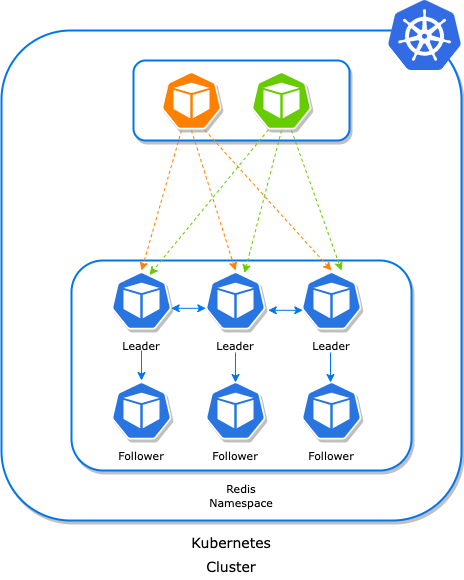

# Nextcloud-con-cluster-en-kubernetes
Instalacion de Nextcloud en kubernetes usando clusters de postgresql y redis para alta disponibilidad

## Postgresql
Postgresql es la base de datos que usaremos para almacenar la informacion de Nextcloud ademas de los metadatos que se generen. para la generacion del cluster:

### CloudNativePG
Es un operador de código abierto para Kubernetes que admite la creacion clústeres PostgreSQL basados ​​en replicación de transmisión asincrónica y sincrónica para administrar múltiples réplicas en espera activa dentro del mismo clúster de Kubernetes, con las siguientes especificaciones:

- Un servidor principal, con múltiples réplicas opcionales en espera activa para alta disponibilidad 
- Servicios disponibles para aplicaciones:
  *  **rw:** las aplicaciones se conectan solo a la instancia principal del clúster
  *  **ro:** las aplicaciones se conectan solo a réplicas en espera activa para cargas de trabajo de solo lectura (opcional)
  *  **r:** las aplicaciones se conectan a cualquiera de las instancias para cargas de trabajo de solo lectura (opcional)

El siguiente diagrama proporciona una vista simplista de la arquitectura compartida recomendada para un clúster PostgreSQL


#### Cargas de trabajo de lectura y escritura
Nextcloud usara la instancia maestra de PostgreSQL para las acciones de escritura/lectura de la base de datos, como se muestra en el siguiente diagrama:


> [!NOTE]
>Las aplicaciones usaran el servicio de sufijo **-rw**.

> [!TIP]
> En caso de indisponibilidad temporal o permanente del servidor principal, para fines de alta disponibilidad CloudNativePG activará una conmutación por error, apuntando el -rw servicio a otra instancia del clúster.

#### Cargas de trabajo de solo lectura
Nextcloud usara las instancias replicas de PostgreSQL para las acciones de lectura de la base de datos, como se muestra en el siguiente diagrama:


> [!NOTE]
> Las aplicaciones usaran el servicio de sufijo **-ro**.

### Instalacion del cluster PostgreSQL
Para la instalacion usaremos el manifiesto YAML, de la documentacion

```
kubectl apply --server-side -f \
https://raw.githubusercontent.com/cloudnative-pg/cloudnative-pg/release-1.26/releases/cnpg-1.26.0.yaml
```

Comprobamos la instalacion
```
kubectl get pods -n cnpg-system
```
```
NAME                                      READY   STATUS    RESTARTS      AGE
cnpg-controller-manager-6848689f4-l2ztv   1/1     Running   0             4m
```

Usamos el manifiesto YAML para la creacion del cluster
```yaml
apiVersion: postgresql.cnpg.io/v1
kind: Cluster
metadata:
  name: postgresql-node
spec:
  instances: 3
  imageName: ghcr.io/cloudnative-pg/postgresql:17.5
  primaryUpdateStrategy: unsupervised

  bootstrap:
    initdb:
      dataChecksums: true
      database: nextcloud
      owner: nextcloud
      secret:
        name: cluster-secrets

  resources:
    requests:
      memory: "512Mi"
      cpu: "1"
    limits:
      memory: "1Gi"
      cpu: "2"

  storage:
    size: 10Gi
    pvcTemplate:
      accessModes:
        - ReadWriteOnce
      resources:
        requests:
          storage: 1Gi
      storageClassName: standard
      volumeMode: Filesystem

  walStorage:
    size: 5Gi

  managed:
    services:
      ## disable the default services
      disabledDefaultServices: ["r"]
```
```
kubectl apply -f cluster-postgresql.yaml
```

Crearemos las copias de seguridad periódicas
```
apiVersion: postgresql.cnpg.io/v1
kind: ScheduledBackup
metadata:
  name: postgresql-node-backup
  labels:
    app.kubernetes.io/component: database-backup
spec:
  schedule: "0 0 23/12 * * *"
  backupOwnerReference: none
  immediate: false
```

Verificamos el funcionamiento del cluster
```
kubectl get pods
```
```
NAME                               READY   STATUS    RESTARTS        AGE
postgresql-node-1                  1/1     Running   0               3m
postgresql-node-2                  1/1     Running   0               3m
postgresql-node-3                  1/1     Running   0               3m
```
```
kubectl get services
```
```
NAME                                 TYPE        CLUSTER-IP       EXTERNAL-IP   PORT(S)     AGE
kubernetes                           ClusterIP   10.96.0.1        <none>        443/TCP     1d
postgresql-node-ro                   ClusterIP   10.97.85.79      <none>        5432/TCP    3m
postgresql-node-rw                   ClusterIP   10.111.110.188   <none>        5432/TCP    3m
```
> [!NOTE]
> Para mayor informacion del servicio, leer la documentacion [aqui](https://cloudnative-pg.io/documentation/1.26/).

## Redis
Redis es el serviodr de almacenamiento servira como almacenamiento cache de datos de navegacion dando mayor velocidad. para la generacion del cluster:

### OT Redis Operator
Es un operador que gestiona la configuración de Redis en modo independiente, clúster, replicación y centinela sobre Kubernetes. Permite crear una configuración de clúster de Redis con las mejores prácticas.

El operador de Redis admite las siguientes estrategias de implementación para Redis:

- **Clúster:** Es simplemente una estrategia de fragmentación de datos . Particiona automáticamente los datos entre múltiples nodos de Redis. Es una función avanzada de Redis que logra almacenamiento distribuido y evita un punto único de fallo.
- **Replicación:** Utiliza replicación asíncrona, lo que significa que el nodo líder no espera a que los nodos seguidores apliquen los cambios antes de enviar nuevas actualizaciones. En su lugar, los nodos seguidores se ponen al día con el nodo líder tan pronto como pueden.
- **Sentinel:** Es una herramienta que proporciona conmutación por error y monitorización automáticas para los nodos de Redis.

Para el caso actual, usaremos el metodo de cluster,El siguiente diagrama proporciona una vista simplista de la arquitectura compartida



### Instalacion del Cluster Redis
Añadimos el repositorio en helm y lo instalamos
```
helm repo add ot-helm https://ot-container-kit.github.io/helm-charts/
helm install redis-operator ot-helm/redis-operator --namespace ot-operators --create-namespace 
```
Comprobamos la instalacion
```
kubectl get pods -n ot-operators
```
```
NAME                             READY   STATUS    RESTARTS      AGE
redis-operator-bb784b6df-4pfxt   1/1     Running   0             4m
```
Usamos el manifiesto YAML para la creacion del cluster
```yaml
apiVersion: redis.redis.opstreelabs.in/v1beta2
kind: RedisCluster
metadata:
  name: redis-cluster
spec:
  clusterSize: 3
  clusterVersion: v7
  podSecurityContext:
    runAsUser: 0 
    fsGroup: 0 #1000
  persistenceEnabled: true
  kubernetesConfig:
    image: quay.io/opstree/redis:v7.0.12
    imagePullPolicy: IfNotPresent
    resources:
      requests:
        cpu: 101m
        memory: 1Gi
      limits:
        cpu: 1000m
        memory: 6Gi
    redisSecret:
      name: password-nextcloud
      key: redis_password 

  redisLeader:
    replicas: 3
    securityContext:
      allowPrivilegeEscalation: true
      runAsGroup: 0 #1000
      runAsUser: 0 
      
  redisFollower:
    replicas: 3
    securityContext:
      allowPrivilegeEscalation: true
      runAsGroup: 0 #1000
      runAsUser: 0

  storage:
    volumeClaimTemplate:
      spec:
        storageClassName: standard
        accessModes: ["ReadWriteOnce"]
        resources:
          requests:
            storage: 10Gi
```
```
kubectl apply -f cluster-redis.yaml
```

Verificamos el funcionamiento del cluster
```
kubectl get pods
```
```
NAME                       READY   STATUS    RESTARTS   AGE
redis-cluster-follower-0   1/1     Running   0          99s
redis-cluster-follower-1   1/1     Running   0          67s
redis-cluster-follower-2   1/1     Running   0          46s
redis-cluster-leader-0     1/1     Running   0          3m21s
redis-cluster-leader-1     1/1     Running   0          2m54s
redis-cluster-leader-2     1/1     Running   0          2m10s
```
```
kubectl get services
```
```
NAME                                TYPE        CLUSTER-IP      EXTERNAL-IP   PORT(S)    AGE
kubernetes                          ClusterIP   10.96.0.1       <none>        443/TCP    90d
redis-cluster-follower              ClusterIP   10.96.32.211    <none>        6379/TCP   2m36s
redis-cluster-follower-additional   ClusterIP   10.101.183.30   <none>        6379/TCP   2m36s
redis-cluster-follower-headless     ClusterIP   None            <none>        6379/TCP   2m36s
redis-cluster-leader                ClusterIP   10.97.190.34    <none>        6379/TCP   4m18s
redis-cluster-leader-additional     ClusterIP   10.110.44.13    <none>        6379/TCP   4m18s
redis-cluster-leader-headless       ClusterIP   None            <none>        6379/TCP   4m18s
redis-cluster-master                ClusterIP   10.108.248.73   <none>        6379/TCP   4m17s
```
