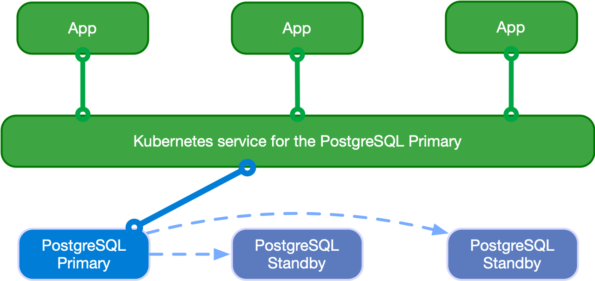

# Nextcloud-con-cluster-en-kubernetes
Instalacion de Nextcloud en kubernetes usando clusters de postgresql y redis para alta disponibilidad

## Postgresql
Postgresql es la base de datos que usaremos para almacenar la informacion de Nextcloud ademas de los metadatos que se generen. para la generacion del cluster:
### CloudNativePG
Es un operador de código abierto para Kubernetes que admite la creacion clústeres basados ​​en replicación de transmisión asincrónica y sincrónica para administrar múltiples réplicas en espera activa dentro del mismo clúster de Kubernetes, con las siguientes especificaciones:

- Un servidor principal, con múltiples réplicas opcionales en espera activa para alta disponibilidad 
- Servicios disponibles para aplicaciones:
  *  **rw:** las aplicaciones se conectan solo a la instancia principal del clúster
  *  **ro:** las aplicaciones se conectan solo a réplicas en espera activa para cargas de trabajo de solo lectura (opcional)
  *  **r:** las aplicaciones se conectan a cualquiera de las instancias para cargas de trabajo de solo lectura (opcional)

El siguiente diagrama proporciona una vista simplista de la arquitectura compartida recomendada para un clúster PostgreSQL


#### Cargas de trabajo de lectura y escritura
Nextcloud usara la instancia maestra de PostgreSQL para las acciones de escritura/lectura de la base de datos, como se muestra en el siguiente diagrama:



> [!NOTE]
>Las aplicaciones usaran el servicio de sufijo **-rw**.

> [!TIP]
> En caso de indisponibilidad temporal o permanente del servidor principal, para fines de alta disponibilidad CloudNativePG activará una conmutación por error, apuntando el -rw servicio a otra instancia del clúster.

#### Cargas de trabajo de solo lectura
Nextcloud usara las instancias replicas de PostgreSQL para las acciones de lectura de la base de datos, como se muestra en el siguiente diagrama:


> [!NOTE]
>Las aplicaciones usaran el servicio de sufijo **-ro**.

### Instalacion del cluster
Para la instalacion usaremos el manifiesto YAML, de la documentacion

```
kubectl apply --server-side -f \
https://raw.githubusercontent.com/cloudnative-pg/cloudnative-pg/release-1.26/releases/cnpg-1.26.0.yaml
```

Comprobamos la instalacion
```
kubectl get pods -n cnpg-system
```

Usamos el manifiesto YAML para la creacion del cluster
```yaml
apiVersion: postgresql.cnpg.io/v1
kind: Cluster
metadata:
  name: postgresql-node
spec:
  instances: 3
  imageName: ghcr.io/cloudnative-pg/postgresql:17.5
  primaryUpdateStrategy: unsupervised

  bootstrap:
    initdb:
      dataChecksums: true
      database: nextcloud
      owner: nextcloud
      secret:
        name: cluster-secrets

  resources:
    requests:
      memory: "512Mi"
      cpu: "1"
    limits:
      memory: "1Gi"
      cpu: "2"

  storage:
    size: 10Gi
    pvcTemplate:
      accessModes:
        - ReadWriteOnce
      resources:
        requests:
          storage: 1Gi
      storageClassName: standard
      volumeMode: Filesystem

  walStorage:
    size: 5Gi

  managed:
    services:
      ## disable the default services
      disabledDefaultServices: ["r"]
```
```
kubectl apply -f cluster-postgresql.yaml
```

Crearemos las copias de seguridad periódicas
```
apiVersion: postgresql.cnpg.io/v1
kind: ScheduledBackup
metadata:
  name: postgresql-node-backup
  labels:
    app.kubernetes.io/component: database-backup
spec:
  schedule: "0 0 23/12 * * *"
  backupOwnerReference: none
  immediate: false
  cluster:
    name: "postgresql-node" 
```

Verificamos el funcionamiento del cluster
```
kubectl get pods
```

## Redis

